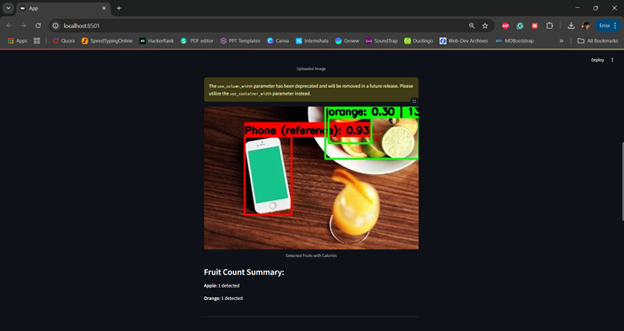

# 🍎 NutriTrack - Food Calorie Estimator 🍌🍊  

## 🚀 Overview  

NutriTrack is an intelligent food calorie estimation application that leverages **computer vision** and **deep learning** to detect fruits in images and estimate their calorie content. Using **YOLOv8** for real-time object detection and a **cell phone as a reference object**, NutriTrack achieves accurate **size and weight estimation** for precise calorie calculations.  

<p align="center">
  
</p> 

<p align="center">
  
</p> 

## 🌟 Features  

✅ **Real-time Fruit Detection** – Identifies common fruits 🍏🍌🍊🍇🍍🍉  
✅ **Calorie Estimation** – Computes calorie content based on fruit type and size 🔥  
✅ **Reference Scaling** – Uses a cell phone 📱 as a reference for accurate measurements  
✅ **Detailed Analytics** – Provides insights including:  
   - 📏 **Weight estimation** for each fruit  
   - 🔢 **Calorie content per fruit**  
   - 📊 **Total calories per fruit type**  
   - 🍽️ **Fruit count summary**  

## 🛠️ Technology Stack  

- 🎨 **Frontend**: Streamlit – Interactive web interface  
- 🔍 **Object Detection**: YOLOv8 (You Only Look Once) model  
- 🖼️ **Image Processing**: OpenCV & NumPy  
- 📊 **Data Visualization**: Custom OpenCV annotations  

## 📥 Installation  

1️⃣ **Clone the repository**  
```bash
git clone https://github.com/yourusername/nutritrack.git
cd nutritrack
```  

2️⃣ **Create a virtual environment and activate it**  
```bash
python -m venv venv
source venv/bin/activate  # On Windows: venv\Scripts\activate
```  

3️⃣ **Install the required dependencies**  
```bash
pip install -r requirements.txt
```  

## ▶️ Usage  

1️⃣ **Start the Streamlit application**  
```bash
streamlit run app.py
```  

2️⃣ **Upload an image** containing fruits and a cell phone (as a reference object).  

3️⃣ **NutriTrack will:**  
   - 🕵️ Detect fruits in the image  
   - 📐 Estimate size & weight  
   - 🔢 Calculate calorie content  
   - 📊 Display results with visual analytics  

## 🧠 How It Works  

### 🔍 Object Detection  
NutriTrack employs **YOLOv8**, a **state-of-the-art** real-time object detection system, to **identify** fruits and the reference object (cell phone).  

### 📏 Size & Weight Estimation  
1️⃣ Detects the **cell phone** as a known **reference object** (7.5 cm width).  
2️⃣ Computes the **pixel-to-cm ratio** for accurate scaling.  
3️⃣ Uses fruit dimensions to estimate **volume and weight**.  

### 🔥 Calorie Calculation  
Each fruit type has a **calorie density** (kcal per 100g). NutriTrack **multiplies** the estimated **weight** by this value to compute the total calories.  

## ⚠️ Limitations  

🔹 Currently supports only **specific fruits** (🍏🍌🍊🍇🍍🍉)  
🔹 Requires a **cell phone** in the image for size estimation  
🔹 Accuracy depends on **image quality & visibility**  

## 🚀 Future Scope  

### 🌍 **Flask API for Global Scalability**  
🔹 Build a **Flask-based API** for serving model predictions  
🔹 Develop a **responsive web app** for cross-platform support  
🔹 Implement **user accounts & history tracking**  
🔹 Deploy using **container orchestration** for scalability  
🔹 Enable **community contributions** for dataset expansion  

### 🏋️ **Model Improvements**  
🔹 Compare performance with **MobileNetV4** for efficiency  
🔹 Expand the **fruit & food database** 📚  
🔹 Add **detailed nutritional information** beyond calories  
🔹 Train on a **custom dataset** for enhanced accuracy  

### 🌟 **Additional Features**  
🔹 🥗 **Meal planning & dietary tracking**  
🔹 🎯 **Nutritional goal setting**  
🔹 📖 **Recipe suggestions based on detected ingredients**  
🔹 🌱 **Dietary awareness** (vegetarian, vegan, gluten-free)  
🔹 ⌚ **Integration with fitness & health platforms**  

## 📋 Requirements  

✔️ **Python 3.8+**  
✔️ **Streamlit**  
✔️ **OpenCV**  
✔️ **NumPy**  
✔️ **Ultralytics YOLOv8**  
✔️ **PIL (Python Imaging Library)**  

## 🤝 Contributing  

Contributions are **welcome**! 🚀 Follow these steps to contribute:  

1️⃣ **Fork the repository**  
2️⃣ **Create a feature branch** (`git checkout -b feature/amazing-feature`)  
3️⃣ **Commit your changes** (`git commit -m 'Add amazing feature'`)  
4️⃣ **Push to the branch** (`git push origin feature/amazing-feature`)  
5️⃣ **Open a Pull Request** ✅  

---

🔥 **NutriTrack – Your Smart Food Companion!** 🍏📱💡
